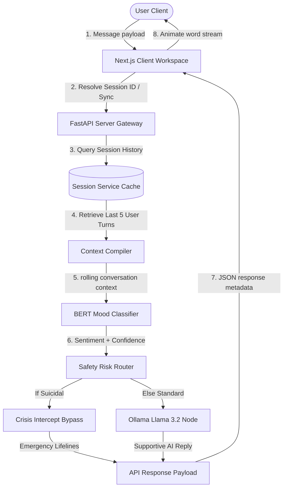
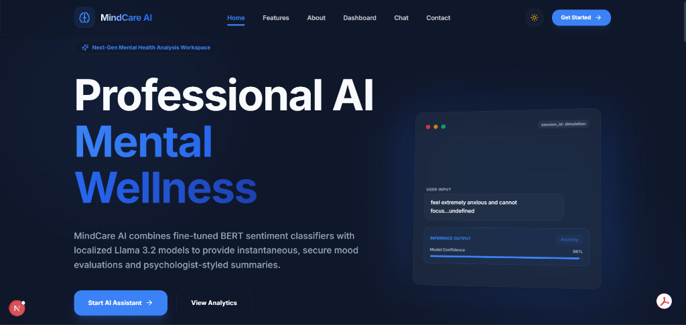
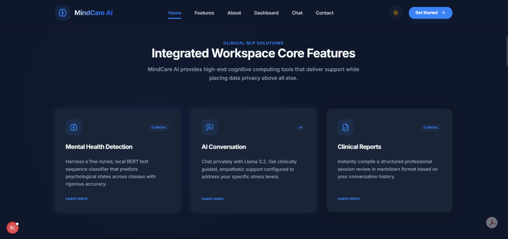
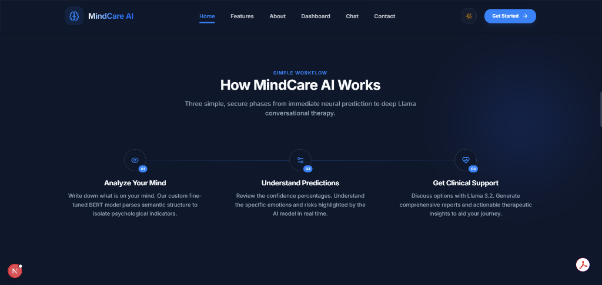
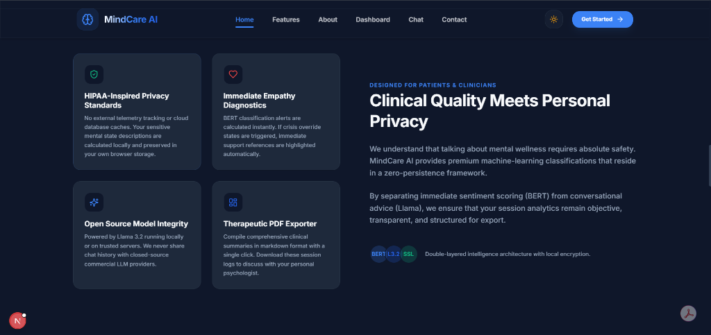
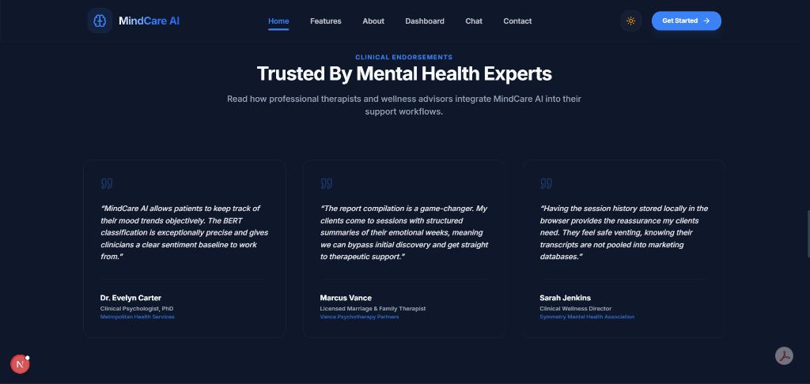

# 🧠 MindCare AI

A premium, production-ready AI-powered Mental Health Companion. MindCare AI couples a fine-tuned Hugging Face **BERT** sequence classifier for mood detection with localized **Ollama (Llama 3.2)** LLMs for secure, clinically guided empathetic response generation. Built on a modular, feature-based **Next.js 15 (App Router)** and **FastAPI** architecture.

---

## 🛡️ Project Technology Badges


---

## 📖 Table of Contents
1. [Project Overview](#-project-overview)
2. [Key Features](#-key-features)
3. [System Architecture](#-system-architecture)
4. [Folder Structure Tree](#-folder-structure-tree)
5. [Core API Schema](#-core-api-schema)
6. [Installation & Setup](#-installation--setup)
7. [In-Depth Feature Showcases](#-in-depth-feature-showcases)
8. [Code Quality & Security Safety](#-code-quality--security-safety)
9. [Future Roadmap](#-future-roadmap)
10. [License](#-license)
11. [Author](#-author)

---

## 🎯 Project Overview

MindCare AI is designed to look and feel like a premium AI SaaS platform (drawing design inspiration from Stripe, Vercel, and Linear). The platform is divided into two parts:
1. **The Backend REST API Service**: Serves connection statuses, evaluates mood states, logs client feedback, compiles reports, and acts as a gateway to the local Ollama LLM node.
2. **The Next.js Frontend Client**: Provides responsive chat rooms, simulated word-by-word LLM typing streams, interactive custom tooltips, numerical count-ups, and dark mode toggles.

---

## ✨ Key Features

* **Context-Aware Sequence Classification**: The backend groups user queries into a rolling context window of the last 5 messages. This prevents sentiment diagnostics from incorrectly flipping back to `"Normal"` on short ambiguous sentences.
* **Empathetic Dialogue Engine**: Utilizes local Llama 3.2 instances to generate supportive, warm, non-medical recommendations.
* **RLHF & Feedback Logs**: Users can log feedback on assistant responses. Positive/negative interactions are written to `rlhf_logs.csv` to support future reinforcement learning.
* **Clinician Markdown Exporter**: Instantly compiles multi-turn dialog logs into clean, structured Markdown reports outlining sentiment distributions and guidelines.
* **Next-Gen Aesthetics**: Stunning visual interfaces featuring glassmorphic navigation bars, 3D rotating mockups, sliding hover states, and smooth grid transitions.
* **Absolute Data Privacy**: Active logs are stored only in the browser's local storage context. Logs can be cleared permanently in one click.

---

## 🏗️ System Architecture

MindCare AI pipelines data using the following workflow:



---

## 📂 Folder Structure Tree

```
MindCare-AI/
├── backend/                       # Python FastAPI backend server
│   ├── config/                    # Configuration settings & environment variables
│   │   ├── constants.py           # Core label constants
│   │   └── settings.py            # Pydantic Settings env loader
│   ├── middleware/                # CORS, request logging handlers
│   ├── models/                    # Pydantic schema contracts
│   ├── routes/                    # API endpoints (health, predict, chat, report, feedback)
│   ├── services/                  # Business logic (BERT loader, Ollama client, cache)
│   ├── utils/                     # Shared helpers
│   ├── app.py                     # API app gateway entry point
│   ├── requirements.txt           # Core Python dependencies
│   └── .env.example               # Backend sample environment variables
├── frontend/                      # Next.js 15 Tailwind CSS client application
│   ├── app/                       # Page routes, layout contexts, providers
│   ├── components/                # Shared layout & theme selectors
│   ├── features/                  # Feature modular components
│   │   ├── chat/                  # Sidebar drawers, bubbles, analysis panels
│   │   ├── dashboard/             # Recharts widgets, counters, tooltips
│   │   ├── landing/               # Hero loops, FAQ, timelines, navigation
│   │   └── reports/               # Markdown clinicians exporter
│   ├── hooks/                     # Custom hooks (local session storage manager)
│   ├── lib/                       # Global Axios API clients
│   ├── services/                  # React Query api service mutation schemas
│   ├── types/                     # Shared TypeScript interface models
│   ├── package.json               # Frontend dependencies list
│   └── .env.example               # Frontend sample environment variables
├── ml-original/                   # Original BERT model training weights directory
├── CHANGELOG.md                   # Logs detailing updates and bug fixes
├── LICENSE                        # MIT License specifications
└── README.md                      # Detailed portfolio documentation
```

---

## 🔌 Core API Schema

All API contracts preserve clean JSON payloads:

### 1. Predict Sentiment
* **Endpoint**: `POST /api/predict`
* **Request**: `{ "text": "I feel extremely anxious." }`
* **Response**:
  ```json
  {
    "prediction": "Anxiety",
    "confidence": 0.9958,
    "probabilities": {
      "Normal": 0.001,
      "Depression": 0.003,
      "Anxiety": 0.9958,
      "Suicidal": 0.0002
    }
  }
  ```

### 2. Chat Dialogue
* **Endpoint**: `POST /api/chat`
* **Request**: `{ "session_id": "resolved-uuid", "message": "I cannot sleep." }`
* **Response**:
  ```json
  {
    "reply": "I hear you. Let's take a deep breath together...",
    "prediction": "Anxiety",
    "confidence": 0.9854,
    "crisis": false,
    "timestamp": "2026-07-11T00:58:12"
  }
  ```

### 3. Generate Report
* **Endpoint**: `POST /api/report`
* **Request**: `{ "session_id": "resolved-uuid" }`
* **Response**:
  ```json
  {
    "report": "# Clinician Session Summary\n\n- **Session ID**: resolved-uuid\n..."
  }
  ```

---

## 🚀 Installation & Setup

Before installing, ensure you have **Python 3.10+**, **Node.js 18+**, and **Ollama** installed on your system.

### Step 1: Clone the Repository
```bash
git clone https://github.com/yourusername/MindCare-AI.git
cd MindCare-AI
```

### Step 2: Configure Ollama LLM
1. Download and start [Ollama](https://ollama.com).
2. Fetch the Llama 3.2 model in your terminal:
   ```bash
   ollama run llama3.2
   ```

### Step 3: Launch the Backend Service
1. Navigate to the `backend/` directory:
   ```bash
   cd backend
   ```
2. Create and activate a Python virtual environment:
   ```bash
   python -m venv venv
   # On Windows:
   .\venv\Scripts\activate
   # On macOS/Linux:
   source venv/bin/activate
   ```
3. Install dependencies:
   ```bash
   pip install -r requirements.txt
   ```
4. Set up configurations:
   ```bash
   cp .env.example .env
   ```
5. Run the FastAPI development server:
   ```bash
   uvicorn app:app --reload --port 8000
   ```
   *The backend will boot at `http://127.0.0.1:8000`. Test endpoints using the Swagger UI at `http://127.0.0.1:8000/docs`.*

### Step 4: Launch the Frontend Web Client
1. Open a new terminal and navigate to the `frontend/` directory:
   ```bash
   cd frontend
   ```
2. Install Node packages:
   ```bash
   npm install --legacy-peer-deps
   ```
3. Set up environment configurations:
   ```bash
   cp .env.example .env.local
   ```
4. Run the Next.js development server:
   ```bash
   npm run dev
   ```
   *The Next.js client will boot at `http://localhost:3000`.*

---

## 🛠️ In-Depth Feature Showcases

### 📊 Clinician Reports & Analytics Dashboard
MindCare AI aggregates local browser states to construct real-time diagnostic analytics.
* **Area charts** display stress and anxiety progression over time.
* **Interactive Tooltips** show floating percentage values.
* **Practitioner Reports** can be downloaded directly from the active chat view as markdown files, containing timeline diagnostics, mood ratios, and support overrides.

### 🧠 Context-Aware Predictor (BERT)
By building a rolling user-input window of the last 5 turns:
* Sentence sequence length is optimized for BERT transformer models.
* Sentiment remains context-aware instead of dropping to `"Normal"` when user messages are brief.

---

## 🔒 Code Quality & Security Safety

* **No Committed Secrets**: Virtual environments, compile caches (`.next/`, `__pycache__/`), local settings (`.env`), and large model weight folders are strictly ignored under root git constraints.
* **TypeScript Integrity**: The frontend contains zero assertions or typescript exceptions, ensuring clean type checks.
* **Local Data Guarantee**: All chat session records are persisted using browser-native local storage. No data is stored permanently on remote database clusters, ensuring client privacy.

---

## 🗺️ Future Roadmap

* **Advanced Local Quantization**: Incorporate WebLLM to run client-side inference directly inside browser engines.
* **Secure Hybrid Encryptions**: Add AES-256 database serialization layers.
* **Audio Voice Dictation**: Integrate local Whisper model endpoints for voice-to-text inputs.

---

## 📸 Platform Previews & Screenshots

### 1. Modern Workspace Hero Landing


### 2. Workspace Core Features


### 3. Systematic Treatment Workflow


### 4. Clinical Privacy & HIPAA Protocols


### 5. Verified Professional Endorsements


---

## 📄 License

Distributed under the **MIT License**. See [LICENSE](LICENSE) for more information.

---

## 👥 Author

Developed and Architected by **Shreya** and team. Crafting production-grade mental health analytics workspaces.
